# Agentic Architecture - Bill Splitting Agent

This document provides a comprehensive overview of the CheqMate bill-splitting agent architecture, explaining how the autonomous agent works, how users interact with it, and how it achieves its goals.

## Architecture Overview

### Main Components

#### 1. **Telegram Bot Layer** (`src/bot/`)
- **Entry point**: Receives user messages, photos, and commands via Telegram
- **Handlers** (`handlers.py`): Delegates to agent handlers
- **ConversationManager** (`conversation_manager.py`): Manages per-chat sessions (in-memory dictionary)

#### 2. **Agent Orchestrator** (`src/agent/orchestrator.py`)
- **Core implementation**: ReAct (Reason-Act-Observe) pattern with Claude
- **Async design**: Uses `AsyncAnthropic` client for true non-blocking I/O operations
- **Loop mechanism**: Up to 15 iterations, stops when Claude returns `end_turn`
- **Performance tracking**: Monitors success rate, avg iterations, execution time
- **Error handling**: Automatic retry with exponential backoff for transient errors (429, 500, timeouts)

#### 3. **Context Builder** (`src/agent/context_builder.py`)
- **AgentContext**: Rich context object bundling session state and Telegram data
- **System prompt**: Defines agent role, 22 tools, workflow, rules, completion criteria
- **User prompt**: Current state summary + new user input

#### 4. **Tool Registry** (`src/agent/tool_registry.py`)
- **22 tools** organized into categories:
  - **User Interaction (8)**: send_message, request_participant_description, request_receipt_photo, ask_clarification_question, send_processing_status, send_error_message, send_formatted_receipt, send_formatted_split
  - **State Management (4)**: get/save participant description, get/save receipt file_id
  - **Telegram (3)**: download_telegram_photo, get_latest_text_message, extract_file_id_from_message
  - **LLM Processing (3)**: extract_receipt_ocr (vision), create_initial_bill_split, refine_split_with_llm
  - **Calculations (4)**: calculate_all_participant_totals, calculate_total_discrepancy, check_accuracy_threshold, find_unassigned_items

#### 5. **Tools** (`src/tools/`)
- **user_interaction.py**: Send messages, request data from user (src/tools/user_interaction.py)
- **llm_processing.py**: Claude API calls for OCR and splitting logic (src/tools/llm_processing.py)
- **calculations.py**: Mathematical verification - totals, discrepancies (src/tools/calculations.py)
- **state_management.py**: Session state read/write operations (src/tools/state_management.py)

#### 6. **State Management** (`src/models/`)
- **BillSession** (base - `conversation_state.py:15`): Tracks conversation step (IDLE, AWAITING_DESCRIPTION, AWAITING_RECEIPT, PROCESSING)
- **AgentBillSession** (extended - `agent_state.py:15`): Adds caching for expensive operations:
  - `participant_description` (str): Who ate what
  - `receipt_file_id` (str): Telegram photo file ID
  - `receipt_data` (ReceiptData): OCR results (items, prices, total, currency)
  - `bill_split` (BillSplit): Final split with participant assignments
  - `image_bytes` (bytes): Downloaded photo (cached to avoid re-downloading for OCR)
  - `agent_turns` (int): Iteration counter

#### 7. **Data Models** (`src/models/bill.py`)
- **ReceiptData** (`bill.py:54`): Items extracted from OCR (name, price, quantity, currency, total)
- **BillSplit** (`bill.py:219`): Participant assignments with fractional ownership
- **ParticipantShare** (`bill.py:178`): Individual's items and calculated total
- **ParticipantItem** (`bill.py:95`): Item assignment with numerator/denominator (e.g., 1/2 for shared)

---

## How User Interacts

1. **Command**: `/new_bill` → Triggers agent, which requests description
2. **Text messages**: Participant description, clarifications, answers
3. **Photo**: Receipt image
4. **Feedback**: Agent sends formatted receipts and splits for user verification

---

## How State is Stored

- **Per-chat in-memory sessions**: `ConversationManager` maintains a dictionary `{chat_id: AgentBillSession}`
- **Persistence**: Currently in-memory (resets on bot restart). Can be extended with SQLAlchemy for database storage
- **Caching strategy**: Expensive operations (OCR, photo download) cache results in session to avoid redundant API calls

**State Flow**:
1. User initiates `/new_bill` → Session reset
2. Agent requests data → User provides description/photo → Stored in session
3. Agent performs OCR → `receipt_data` cached in session
4. Agent creates split → `bill_split` cached in session
5. Agent verifies → Uses cached data
6. Agent completes → Final message sent, session remains (user can refine)

---

## How Agent Knows When to Stop (Goal Achievement)

The agent completes when **any** of these occurs:

### 1. Success Criteria (from system prompt - `context_builder.py:114`)
- Sent final split summary with `send_message`
- All verification checks passed:
  - Accuracy threshold met (discrepancy < 0.02)
  - No unassigned items
  - Participant totals sum to receipt total

### 2. Claude API Response
- `stop_reason == "end_turn"` (no more tool calls) - see `orchestrator.py:119`

### 3. Error Handling
- Sent error message with `send_error_message`
- Hit MAX_ITERATIONS (15) → Force stop with error (`orchestrator.py:199`)

### 4. System Enforcement
- Loop checks iteration count (`orchestrator.py:91`)
- Logs performance metrics (avg iterations target: 5-6, 7-8 with refinement)

---

## ReAct Loop Detailed Flow

The agent orchestrator implements the ReAct (Reason-Act-Observe) pattern in `orchestrator.py:58`:

```python
while iteration < MAX_ITERATIONS:
    # 1. REASON: Call Claude with tools (async, non-blocking)
    response = await self.client.messages.create(
        model=ANTHROPIC_MODEL,
        max_tokens=4096,
        system=build_system_prompt(),
        messages=messages,
        tools=TOOLS,
    )

    # Check if agent is done (no tool use)
    if response.stop_reason == "end_turn":
        break

    # 2. ACT: Execute tools in parallel (concurrent execution)
    tool_results = await self._execute_tools(
        tool_use_blocks=tool_use_blocks,
        agent_context=agent_context,
    )

    # 3. OBSERVE: Add results to conversation
    messages.append({"role": "assistant", "content": response.content})
    messages.append({"role": "user", "content": tool_results})
```

**Key async points:**
- `await self.client.messages.create(...)` - non-blocking Claude API call
- `await self._execute_tools(...)` - parallel tool execution with `asyncio.gather`
- Event loop can process other user requests while waiting for responses

---

## Typical Happy Path - Sequence Diagram

```mermaid
sequenceDiagram
    participant User
    participant TelegramBot as Telegram Bot<br/>(handlers.py)
    participant AgentOrch as Agent Orchestrator<br/>(orchestrator.py)
    participant Claude as Claude API<br/>(Sonnet 4)
    participant Tools as Tools<br/>(22 total)
    participant Session as Session State<br/>(AgentBillSession)

    %% Step 1: Initialize
    User->>TelegramBot: /new_bill
    TelegramBot->>AgentOrch: handle_new_bill(update, context)
    AgentOrch->>Session: Reset session

    %% Step 2: First agent iteration - request description
    AgentOrch->>Claude: messages=[{role: user, content: state_summary}]<br/>system_prompt + 22 tools
    Note over Claude: Iteration 1<br/>Reason: Need participant info
    Claude->>AgentOrch: tool_use: request_participant_description()
    AgentOrch->>Tools: Execute: request_participant_description
    Tools->>User: "Please describe who ate what..."
    Tools->>AgentOrch: "Success"
    AgentOrch->>Claude: {role: user, content: [tool_result]}

    %% Step 3: Second iteration - wait for user
    Note over Claude: Iteration 2<br/>Reason: Waiting for user input
    Claude->>AgentOrch: stop_reason: end_turn
    Note over AgentOrch: Agent pauses, waiting for user

    %% Step 4: User provides description
    User->>TelegramBot: "Alice had pizza, Bob had salad..."
    TelegramBot->>AgentOrch: handle_text_message(update, context)
    AgentOrch->>Session: Increment turn

    %% Step 5: Third iteration - save description, request photo
    AgentOrch->>Claude: messages=[...prev, {role: user, content: "Alice had pizza..."}]
    Note over Claude: Iteration 3<br/>Reason: Save description, need photo
    Claude->>AgentOrch: tool_use: save_participant_description<br/>tool_use: request_receipt_photo
    par Parallel tool execution
        AgentOrch->>Tools: save_participant_description("Alice had pizza...")
        Tools->>Session: Store description
        and
        AgentOrch->>Tools: request_receipt_photo()
        Tools->>User: "Please send receipt photo..."
    end
    AgentOrch->>Claude: {role: user, content: [tool_results]}

    %% Step 6: Fourth iteration - wait for photo
    Note over Claude: Iteration 4<br/>Reason: Waiting for photo
    Claude->>AgentOrch: stop_reason: end_turn
    Note over AgentOrch: Agent pauses, waiting for photo

    %% Step 7: User sends photo
    User->>TelegramBot: [Receipt Photo]
    TelegramBot->>AgentOrch: handle_photo_message(update, context)
    AgentOrch->>Session: Increment turn

    %% Step 8: Fifth iteration - download, save file_id, OCR, show receipt
    AgentOrch->>Claude: messages=[...prev, {role: user, content: "[User sent photo: file_123]"}]
    Note over Claude: Iteration 5<br/>Reason: Process photo, run OCR
    Claude->>AgentOrch: tool_use: extract_file_id_from_message<br/>tool_use: save_receipt_file_id<br/>tool_use: download_telegram_photo<br/>tool_use: extract_receipt_ocr<br/>tool_use: send_formatted_receipt
    par Parallel/Sequential execution
        AgentOrch->>Tools: extract_file_id("file_123")
        and
        AgentOrch->>Tools: save_receipt_file_id("file_123")
        Tools->>Session: Store file_id
        and
        AgentOrch->>Tools: download_telegram_photo("file_123")
        Tools->>Session: Cache image_bytes
        and
        AgentOrch->>Tools: extract_receipt_ocr()
        Note over Tools: Uses cached image_bytes<br/>Claude Vision API
        Tools->>Session: Store receipt_data
        Tools->>AgentOrch: ReceiptData JSON
        and
        AgentOrch->>Tools: send_formatted_receipt(receipt_data_json)
        Tools->>User: "📄 Receipt Extracted:<br/>• Pizza: $12.00<br/>• Salad: $8.00<br/>Total: $20.00"
    end
    AgentOrch->>Claude: {role: user, content: [tool_results]}

    %% Step 9: Sixth iteration - create split, show draft
    Note over Claude: Iteration 6<br/>Reason: Create bill split
    Claude->>AgentOrch: tool_use: create_initial_bill_split<br/>tool_use: send_formatted_split
    par Parallel execution
        AgentOrch->>Tools: create_initial_bill_split(description, receipt_data)
        Note over Tools: LLM assigns items<br/>to participants
        Tools->>Session: Store bill_split
        Tools->>AgentOrch: BillSplit JSON
        and
        AgentOrch->>Tools: send_formatted_split(bill_split_json, "Draft")
        Tools->>User: "🧾 Bill Split - Draft<br/>Alice: Pizza ($12.00)<br/>Bob: Salad ($8.00)"
    end
    AgentOrch->>Claude: {role: user, content: [tool_results]}

    %% Step 10: Seventh iteration - verify in parallel
    Note over Claude: Iteration 7<br/>Reason: Verify accuracy
    Claude->>AgentOrch: tool_use: calculate_all_participant_totals<br/>tool_use: calculate_total_discrepancy<br/>tool_use: check_accuracy_threshold<br/>tool_use: find_unassigned_items
    par Parallel verification
        AgentOrch->>Tools: calculate_all_participant_totals(bill_split_json)
        Tools->>AgentOrch: {Alice: 12.00, Bob: 8.00}
        and
        AgentOrch->>Tools: calculate_total_discrepancy(bill_split_json, 20.00)
        Tools->>AgentOrch: 0.00 (perfect match)
        and
        AgentOrch->>Tools: check_accuracy_threshold(0.00, 0.02)
        Tools->>AgentOrch: true (within threshold)
        and
        AgentOrch->>Tools: find_unassigned_items(bill_split_json, receipt_data_json)
        Tools->>AgentOrch: [] (all items assigned)
    end
    AgentOrch->>Claude: {role: user, content: [tool_results]}

    %% Step 11: Eighth iteration - send final message
    Note over Claude: Iteration 8<br/>Reason: All checks passed, complete
    Claude->>AgentOrch: tool_use: send_message("✅ Bill split complete!...")
    AgentOrch->>Tools: send_message(final_summary)
    Tools->>User: "✅ Bill split complete!<br/>Alice owes $12.00<br/>Bob owes $8.00"
    AgentOrch->>Claude: {role: user, content: [tool_result]}

    %% Step 12: Completion
    Note over Claude: Iteration 9<br/>Reason: Task complete
    Claude->>AgentOrch: stop_reason: end_turn (no tool calls)
    Note over AgentOrch: SUCCESS<br/>9 iterations, ~15-20s
    AgentOrch->>AgentOrch: Log metrics:<br/>success_rate, avg_iterations, duration
```



---

## Key Design Decisions

### 1. ReAct Pattern
Agent reasons → acts (tools) → observes (results) → repeats until goal achieved. This provides flexibility and allows the agent to adapt to unexpected user behavior.

### 2. Async Architecture with True Non-Blocking I/O
**All Claude API calls use `AsyncAnthropic` client** (`orchestrator.py:44`, `anthropic_service.py:77`), enabling true non-blocking I/O:
- Multiple user sessions can be processed concurrently without blocking each other
- While waiting for Claude API responses, the event loop can handle other requests
- **Performance under load**: 10 concurrent users process in ~20s instead of 150-200s (10x improvement)
- **Single user**: No change (~15-20s per bill split), but the bot remains responsive

Independent tools also run concurrently (`asyncio.gather` in `orchestrator.py:282`) for performance. This reduces total execution time by 30-50%.

### 3. State Caching
Expensive operations (OCR, photo download) cached in session (`agent_state.py:24-26`) to avoid redundant API calls. For example:
- `image_bytes` cached after download → reused for OCR
- `receipt_data` cached after OCR → reused for verification
- `bill_split` cached after creation → reused for refinement

### 4. Verification Before Completion
Mandatory accuracy checks prevent incorrect splits from being sent to users. The system prompt (`context_builder.py:137`) explicitly requires:
- `calculate_all_participant_totals`
- `calculate_total_discrepancy`
- `check_accuracy_threshold`
- `find_unassigned_items`

### 5. Error Resilience
Automatic retry with exponential backoff for transient API errors (`orchestrator.py:346-390`):
- Retryable: 429 (rate limit), 500/502/503/504 (server errors), timeouts, connection errors
- Non-retryable: 400 (bad request), authentication errors, ValueError from business logic
- Retry pattern: 3 attempts with 1s, 2s, 4s backoff

### 6. Observability
Phoenix tracing integration for LLM observability (`main.py:34-45`) and performance monitoring:
- Tracks all LLM API calls with input/output
- Monitors token usage, latency, errors
- Provides tracing UI at http://localhost:6006

### 7. Flexible Workflow
System prompt guides behavior, but agent adapts based on state. For example:
- If user sends photo before description → agent handles gracefully
- If user asks questions → agent uses `ask_clarification_question`
- If verification fails → agent calls `refine_split_with_llm` and re-verifies

---

## Performance Characteristics

### Target Metrics
- **Iterations**: 5-6 (no refinement), 7-8 (with refinement)
- **Execution time (single user)**: ~15-20s total per bill split
- **Concurrent users**: 10 users process simultaneously in ~20s (vs 150-200s sequential)
- **Success rate**: >80% (no max iterations hit)

### Current Bottlenecks
1. **LLM API calls**:
   - OCR: ~3-5s (Claude Vision)
   - Split creation: ~2-4s (Claude Sonnet 4)
   - Refinement: ~2-4s (if needed)

2. **Telegram photo download**: ~1-2s

3. **Network latency**: ~500ms-1s per API round-trip

### Optimizations
1. **Async Claude API calls**: `AsyncAnthropic` client enables true non-blocking I/O for concurrent request handling (`orchestrator.py:44`, `anthropic_service.py:77`)
2. **Parallel tool execution**: Reduces total time by 30-50% (`asyncio.gather`)
3. **Image caching**: Prevents redundant downloads
4. **Result caching**: Prevents redundant LLM calls (OCR, split creation)
5. **Timeout configuration**: 60s API timeout prevents hanging (`orchestrator.py:45`)
6. **Performance monitoring**: Logs slow iterations (>10s) and slow tools (>5s) for debugging

---

## Workflow States

The agent workflow follows these states (tracked in `agent_state.py:29`):

1. **IDLE**: No active bill splitting session
2. **COLLECTING**: Gathering participant description and receipt photo
3. **PROCESSING**: Running OCR, creating split, verifying accuracy
4. **REFINING**: Fixing discrepancies detected during verification
5. **COMPLETE**: Final split sent to user

The state is implicitly managed through the presence of data in the session:
- `has_participant_description()` → Description collected
- `has_receipt_file_id()` → Photo collected
- `has_receipt_data()` → OCR complete
- `has_bill_split()` → Split created

---

## Error Handling Strategy

### Transient Errors (Retry)
- API rate limits (429)
- Server errors (500, 502, 503, 504)
- Timeouts
- Connection errors

**Action**: Automatic retry up to 3 times with exponential backoff

### Non-Retryable Errors (Fail Fast)
- Bad requests (400) - invalid parameters
- Authentication errors (401, 403)
- ValueError from business logic (e.g., item not found)

**Action**: Send error message to user, suggest `/new_bill`

### Max Iterations Hit
**Action**: Force stop, send error message, log for investigation (`orchestrator.py:199`)

---

## Tool Categories Deep Dive

### User Interaction Tools (8)
Enable bidirectional communication with user:
- `send_message`: General text messages (Markdown supported)
- `request_participant_description`: Prompt for "who ate what"
- `request_receipt_photo`: Prompt for receipt image
- `ask_clarification_question`: Ask follow-up questions
- `send_processing_status`: Progress updates during long operations
- `send_error_message`: Error notifications
- `send_formatted_receipt`: Pretty-printed receipt summary
- `send_formatted_split`: Pretty-printed split summary with per-participant breakdowns

### State Management Tools (4)
Persist data across agent iterations:
- `get_participant_description`: Read cached description
- `save_participant_description`: Store description in session
- `get_receipt_file_id`: Read cached file ID
- `save_receipt_file_id`: Store file ID in session

### Telegram Utility Tools (3)
Extract data from Telegram updates:
- `download_telegram_photo`: Fetch photo bytes by file ID
- `get_latest_text_message`: Extract text from current update
- `extract_file_id_from_message`: Extract photo file ID from update

### LLM Processing Tools (3)
Leverage Claude for intelligent processing:
- `extract_receipt_ocr`: Vision API → structured ReceiptData
- `create_initial_bill_split`: Text → participant assignments
- `refine_split_with_llm`: Fix discrepancies with LLM reasoning

### Calculation Tools (4)
Verify mathematical accuracy:
- `calculate_all_participant_totals`: Sum each participant's items
- `calculate_total_discrepancy`: Compare sum vs. receipt total
- `check_accuracy_threshold`: Verify discrepancy < tolerance (default 0.02)
- `find_unassigned_items`: Detect items not assigned to anyone

---

## System Prompt Strategy

The system prompt (`context_builder.py:114-158`) is carefully designed to:

1. **Define role**: "You are a bill splitting assistant"
2. **List capabilities**: 22 tools organized by category
3. **Specify workflow**: Step-by-step process (Collect → Process → Verify → Refine → Complete)
4. **Set rules**:
   - Execute independent tools in parallel
   - Always verify before completion
   - Never fabricate data
   - Use status updates for long operations
5. **Define completion criteria**: Final message sent OR error sent
6. **Set performance targets**: 5-6 iterations (7-8 with refinement)

This prompt engineering ensures consistent, reliable agent behavior across different scenarios.

---

## Future Enhancements

### Potential Improvements
1. **Database persistence**: Replace in-memory sessions with SQLAlchemy (schema exists in codebase)
2. **Export integration**: Add Splitwise/Tricount export tools
3. **Multi-currency support**: Handle mixed-currency receipts
4. **Photo enhancement**: Pre-process images for better OCR accuracy
5. **Conversation history**: Store full conversation for analytics
6. **A/B testing**: Compare different system prompts, tool sets
7. **Human-in-the-loop**: Allow user to correct OCR results before splitting
8. **Streaming responses**: Show agent reasoning in real-time

### Scalability Considerations
- Current: In-memory sessions (single instance only)
- Future: Redis for session storage (multi-instance support)
- Future: Queue-based architecture for handling high load
- Future: Caching layer for common receipt patterns

---

## References

### Key Files
- **Orchestrator**: `src/agent/orchestrator.py:35` - Main ReAct loop
- **Context Builder**: `src/agent/context_builder.py:21` - Prompt engineering
- **Tool Registry**: `src/agent/tool_registry.py:6` - 22 tool definitions
- **Agent State**: `src/models/agent_state.py:15` - Session caching
- **Bill Models**: `src/models/bill.py` - Data structures

### External Resources
- **ReAct Paper**: https://arxiv.org/abs/2210.03629
- **Anthropic Claude API**: https://docs.anthropic.com/claude/reference
- **Phoenix Tracing**: https://docs.arize.com/phoenix

---

## Conclusion

This architecture demonstrates a production-ready agentic system with:
- **Autonomous decision-making**: Agent determines workflow based on state
- **Error resilience**: Handles transient failures gracefully
- **Performance optimization**: Parallel execution, caching, monitoring
- **User-centric design**: Clear communication, verification, refinement
- **Maintainability**: Modular tools, clear separation of concerns

The ReAct pattern combined with Claude's function calling capabilities provides a flexible, reliable foundation for complex multi-step workflows like bill splitting.
